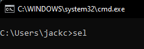
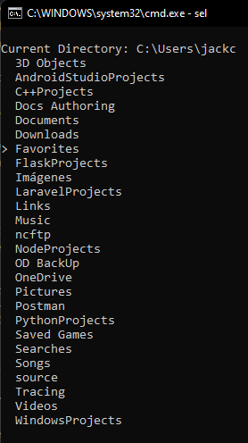
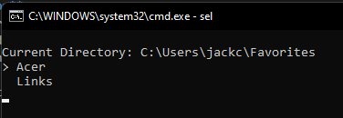
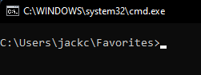

# SelectFolder

**Description**:  
With this project you can navigate (in CMD) through the folders of your computer and select the folder you want to use. Then you can do some actions being in that directory.
It might be tedious to set the current directory to the folder you want to use, so this project is useful.

Other things to include:

  - **Technology stack**: It waws made with Batch Language so it can be used in any Windows computer without having to install any software but this one.

## Installation

In order to install the project you need to do the following:
- Download the **sel.bat** file from this repository.
- DO NOT rename the file.
- Copy the file to the Windows/System32 folder to be able to use it from everywhere in the computer. [Get more info](https://www.instructables.com/How-to-Create-your-own-Commands-with-Batch/)

## Usage

**Screenshots**:

The command is `sel`, you can use it with CMD in any directory.

After executing the command, you will see a list of folders in the current directory. With the keys `W`, `S`, `A`, `D` you can navigate through the folders (`W` is up, `S` is down among the current folders and, `A` is to go to parent directory and `D` is to enter to the selected folder).

After you enter the selected folder or go to the parent directory, you will see the list of folders in that directory. And you can navigate through them with the keys `W`, `S`, `A`, `D` as well.

When you are in the target folder, you can press `X` to exit the program and the terminal will be placed in the folder you were in before.

----

## License
SelectFolder is licensed under the [MIT license](https://opensource.org/licenses/MIT).